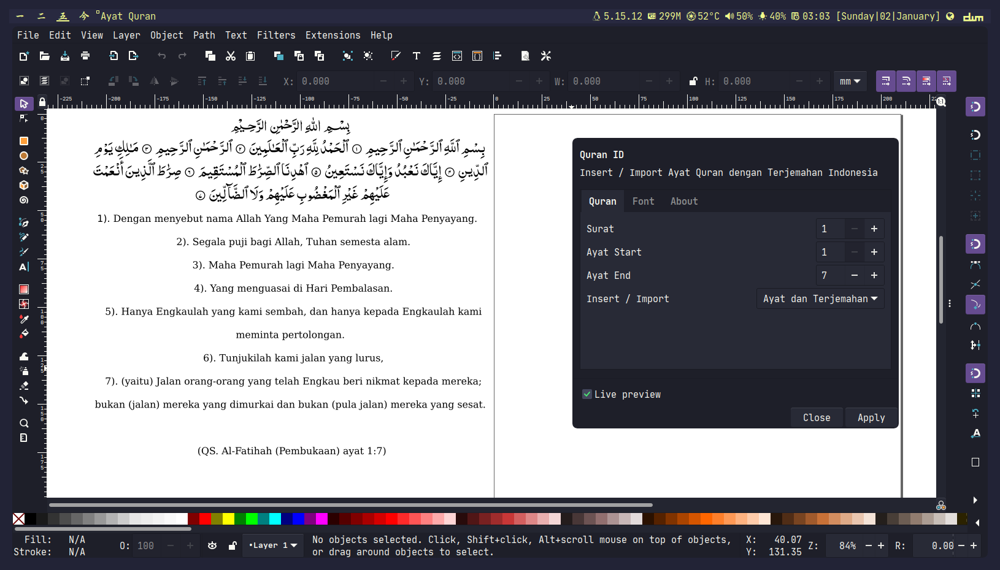

# Al-Quran ID
Extenssions Inkscape untuk import / insert ayat al quran dengan terjemahan indonesia. Dikembangkan bersama komunitas **[GimpScape ID](https://t.me/gimpscape)**

# Installasi
```shell
$ pip install alquran-id
$ git clone git@gitlab.com:nesstero/inkscape-quran-id.git
$ cd inkscape-quran-id
$ cp quran.inx quran.py  ~/.config/inkscape/extensions/
```
# Menggunakan extensions quran id
**Extenssions->Render->Ayat Quran**

# Preview

